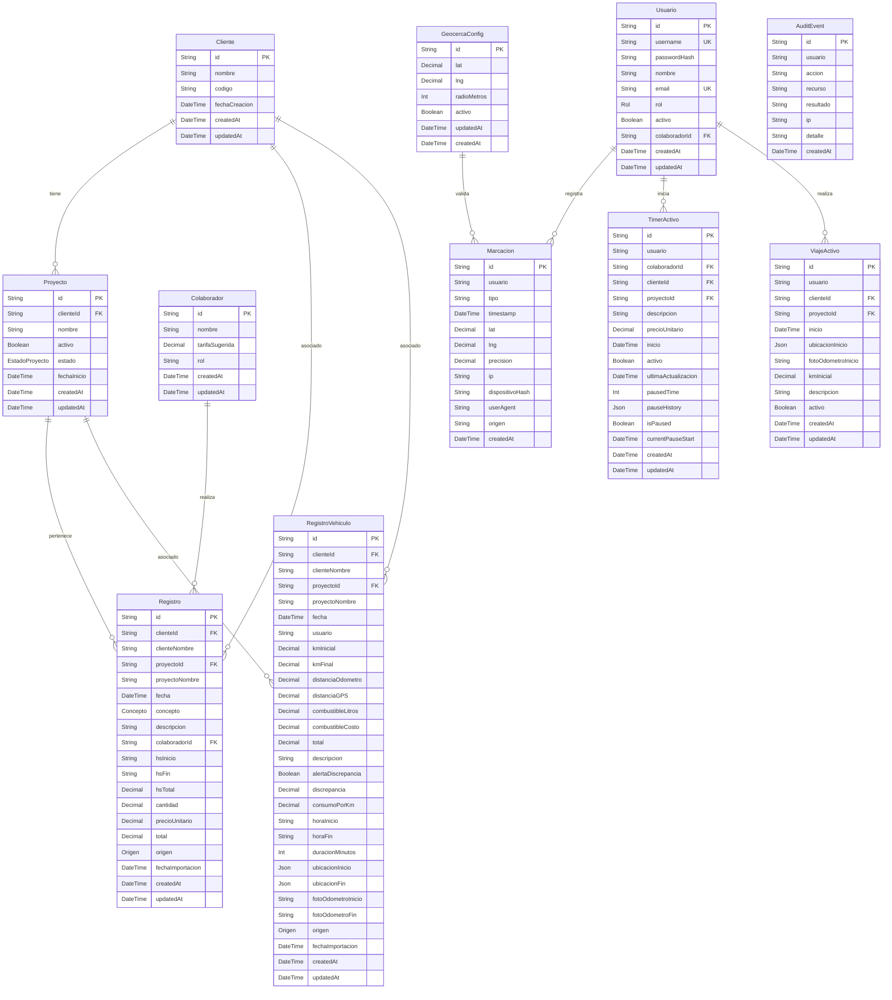

# Manual Técnico — Sistema aFull v2.1
## Plataforma de Automatización Operativa y Control de Personal

Este manual técnico describe la arquitectura, modelo de datos, flujos de control, reglas de negocio, seguridad y configuración del **Sistema aFull v2.1**, una plataforma diseñada para digitalizar, controlar y auditar la operación de instalación de ploteos, vinilos y señalización publicitaria.

---

## 1. Arquitectura del Sistema (SPA + Monolito API)

El sistema está diseñado bajo una arquitectura de **Monolito de API unificado con SPA (Single Page Application)**. 

```mermaid
graph TD
    subgraph Client [Entorno Frontend (React 19)]
        UI[Componentes React + Framer Motion]
        Store[Estado Local & Cache]
        SW[Service Worker - PWA]
    end

    subgraph Server [Backend Monolítico (Node.js + Express)]
        MW[Middlewares: Auth, CSRF, Helmet, RateLimit]
        Routes[API Endpoints: CRUD, Timers, Viajes, Marcaciones]
        Gemini[Google GenAI API]
        Prisma[Prisma Client ORM]
    end

    subgraph Database [Capa de Persistencia]
        DB[(PostgreSQL Supabase)]
        Storage[(Supabase Storage Bucket)]
    end

    UI -->|Peticiones HTTP + CSRF Token| MW
    MW --> Routes
    Routes --> Prisma
    Routes --> Gemini
    Prisma --> DB
    Routes -->|Fotos de Odómetros| Storage
    SW -->|Cache de Assets Estáticos| UI
```

### Componentes de la Arquitectura:
1. **Frontend (Browser):**
   - Construido con **React 19** y empaquetado mediante **Vite 6** y **Tailwind CSS v4**.
   - **PWA (Progressive Web App):** Habilitada mediante `manifest.json` y un Service Worker (`sw.js`) con estrategias de almacenamiento en caché de assets locales para optimizar los tiempos de carga en dispositivos móviles.
2. **Backend (Servidor Express):**
   - Escrito en **TypeScript** y compilado mediante **esbuild** en un bundle ESM único (`dist/server.mjs`).
   - Sirve los recursos estáticos compilados de la SPA en producción y expone la API RESTful bajo `/api`.
3. **Persistencia y Almacenamiento:**
   - Base de datos relacional **PostgreSQL** alojada en **Supabase**, gestionada mediante **Prisma ORM**.
   - Supabase Storage (Bucket: `vehiculos-fotos`) para el almacenamiento físico persistente de las capturas de odómetros.

---

## 2. Modelo de Datos (Esquema Relacional)

La base de datos se compone de 11 tablas gestionadas a través de Prisma. Se implementa desnormalización de nombres de clientes y proyectos en las tablas `Registro` y `RegistroVehiculo` para optimizar consultas de reportes y mitigar saturación de JOINs.



### Tipos Enumerados (Enums en schema.prisma)
- **`EstadoProyecto`**: `PENDIENTE` (mapeado como "Pendiente"), `EN_PROCESO` (mapeado como "En Proceso"), `COMPLETADO` (mapeado como "Completado").
- **`Concepto`**: `MO`, `INSUMO` (mapeado como "Insumo"), `VEHICULO` (mapeado como "Vehículo").
- **`Origen`**: `MANUAL` (mapeado como "Manual"), `EXCEL` (mapeado como "Excel"), `API` (mapeado como "API").
- **`Rol`**: `ADMIN`, `OPERADOR`, `VISOR`.

---

## 3. Reglas de Negocio Críticas

### A. Control Horario por Geocerca (Firewall)
- **Geocerca de Entrada/Salida:** El empleado solo puede realizar marcaciones de jornada si se encuentra dentro de la geocerca activa de la empresa.
- **Coordenadas por defecto (Seed automático):**
  - Latitud: `-25.320588291024226`
  - Longitud: `-57.62418119104182`
  - Radio: `100` metros
- **Cálculo de Distancia (Haversine):** El servidor calcula la distancia en metros entre el GPS reportado por el navegador y la central usando la fórmula:
  $$\Delta\text{lat} = \text{lat}_2 - \text{lat}_1, \quad \Delta\text{lng} = \text{lng}_2 - \text{lng}_1$$
  $$a = \sin^2\left(\frac{\Delta\text{lat}}{2}\right) + \cos(\text{lat}_1) \cdot \cos(\text{lat}_2) \cdot \sin^2\left(\frac{\Delta\text{lng}}{2}\right)$$
  $$d = 2 \cdot R \cdot \text{atan2}(\sqrt{a}, \sqrt{1-a})$$
  Si $d > \text{radioMetros}$, el servidor responde inmediatamente con un error `403 FUERA_DE_ZONA`.
- **Detección de Fraude:** El timeline del administrador agrupa las marcaciones por usuario y analiza las transiciones buscando:
  - `MULTIPLES_IPS`: Peticiones que se originan desde diferentes IPs públicas para el mismo usuario.
  - `MULTIPLES_DISPOSITIVOS`: Peticiones con hashes de dispositivo SHA-256 distintos (generados a partir del string `User-Agent + IP`).

### B. Ciclo de Viajes y Discrepancia del Odómetro
- **Flujo en Dos Fases:**
  1. *Inicio:* Registro de GPS y foto base64 inicial del odómetro (`ViajeActivo`). Se valida de forma preventiva (Fail-Fast) que el vehículo y cliente existan para evitar errores 500 posteriores.
  2. *Fin:* Carga de GPS de destino, odómetro final, cálculo de kilometraje recorrido y foto final.
- **Validación de GPS vs. Odómetro:** El sistema calcula la distancia lineal total en base a los puntos GPS de inicio y fin (fórmula Haversine). Si la discrepancia entre el kilometraje cargado manualmente en el odómetro y la distancia calculada por GPS es superior al 20%, se marca automáticamente el flag `alertaDiscrepancia` en `RegistroVehiculo` para auditoría:
  $$\text{Discrepancia} = \frac{|\text{km}_\text{odometro} - \text{km}_\text{GPS}|}{\text{km}_\text{GPS}} > 0.20$$

### C. Desactivación Lógica (Soft-Deactivation) de Proyectos
- Para mantener la integridad histórica de reportes pasados, los proyectos no se eliminan físicamente al completarse. Se utiliza el atributo lógico `activo: false`.
- **Comportamiento en UI:**
  - En la creación de nuevos registros (Mano de Obra/Insumos) o inicios de viajes, los proyectos inactivos son filtrados y ocultados del dropdown.
  - En el modal de edición de registros históricos, se realiza un bypass: el dropdown del formulario concatena el proyecto actualmente seleccionado en el registro, garantizando que el usuario pueda visualizarlo y guardarlo sin perder consistencia.

---

## 4. Endpoints Clave de la API (RESTful)

### Autenticación y Gestión de Usuarios
- `POST /api/auth/login`: Autentica credenciales y emite un token JWT en una cookie `httpOnly`, segura y con directiva `sameSite: strict`.
- `POST /api/auth/logout`: Invalida la sesión limpiando la cookie JWT.
- `GET /api/auth/me`: Retorna los detalles de la sesión del usuario activo leyendo el payload del token.
- `GET /api/users`: Lista de usuarios sin contraseñas (Admin Only).
- `POST /api/users`: Crea un nuevo usuario validando complejidad (Admin Only).
- `PUT /api/users/:id`: Edición de usuarios, roles y/o contraseñas. Invalida inmediatamente la caché de sesión `userActiveCache` del usuario modificado (Admin Only).
- `DELETE /api/users/:id`: Desactiva/activa lógicamente una cuenta, con soporte para borrado físico permanente mediante `?hard=true` (Admin Only).

### Marcaciones (Geocerca)
- `GET /api/marcacion/config`: Obtiene la latitud, longitud y radio en metros de la geocerca activa. Realiza un seed automático si no existe registro.
- `POST /api/marcacion/entrada`: Valida coordenadas y registra la entrada física estampando el timestamp del servidor y la IP.
- `POST /api/marcacion/salida`: Registra la salida del colaborador aplicando las mismas validaciones.
- `GET /api/marcacion/mis-marcaciones`: Obtiene las últimas 50 marcaciones del colaborador en sesión.
- `GET /api/marcacion/admin/timeline`: Devuelve todas las marcaciones registradas con detecciones de anomalías (`MULTIPLES_IPS`, `MULTIPLES_DISPOSITIVOS`) (Admin Only).

### Mano de Obra y Registros de Insumos/Costos
- `GET /api/data`: Devuelve el estado completo del sistema (clientes, proyectos, colaboradores, registros e históricos).
- `POST /api/registros`: Crea un nuevo registro de mano de obra o insumos.
- `PUT /api/registros/:id`: Edición completa de un registro.
- `PATCH /api/registros/:id`: Modificación parcial de un registro.
- `DELETE /api/registros/:id`: Elimina un registro físicamente.
- `GET /api/registros/mis-registros`: Obtiene los registros del colaborador logueado.

### Proyectos, Clientes y Colaboradores
- `POST /api/clientes` / `PUT /api/clientes/:id` / `DELETE /api/clientes/:id`: ABM de clientes (Admin Only).
- `POST /api/proyectos` / `PUT /api/proyectos/:id` / `DELETE /api/proyectos/:id`: ABM de proyectos (Admin Only).
- `POST /api/colaboradores` / `PUT /api/colaboradores/:id` / `DELETE /api/colaboradores/:id`: ABM de colaboradores (Admin Only).

### Control de Viajes y Vehículos
- `POST /api/viaje/start`: Inicia un viaje registrando GPS, foto de odómetro inicial y km inicial.
- `POST /api/viaje/cancel`: Cancela el viaje activo sin persistir.
- `POST /api/viaje/stop`: Finaliza el viaje. Sube las fotos del odómetro a Supabase Storage y realiza la validación GPS vs Odómetro.
- `GET /api/viaje/active/:usuario`: Obtiene el viaje activo de un usuario si existe.
- `GET /api/vehiculo/registros/:proyectoId`: Obtiene los registros de viaje de un proyecto.
- `GET /api/vehiculo/mis-registros`: Obtiene los viajes del operario en sesión.
- `PUT /api/vehiculo/registro/:id` / `PATCH /api/vehiculo/registro/:id` / `DELETE /api/vehiculo/registro/:id`: ABM de registros de viaje persistidos (Admin Only).

### Cronómetros en Tiempo Real (Timers)
- `POST /api/timer/start`: Inicia un cronómetro para control de mano de obra en un proyecto.
- `POST /api/timer/stop`: Detiene el cronómetro y guarda el tiempo total como registro de Mano de Obra (MO).
- `POST /api/timer/pause`: Pausa temporalmente el cronómetro.
- `POST /api/timer/resume`: Reanuda el cronómetro.
- `POST /api/timer/sync`: Sincroniza el estado del timer local con el servidor.
- `GET /api/timer/active/:usuario`: Obtiene el timer activo actual de un usuario.

### Importación masiva y Enriquecimiento con IA (Gemini)
- `POST /api/import-excel`: Carga un archivo Excel y pre-procesa las filas para importación.
- `POST /api/gemini-enrich`: Llama a Gemini para estructurar, normalizar y asignar proyectos y colaboradores.
- `POST /api/import/confirm`: Guarda en base de datos las filas aprobadas en una transacción atómica.
- `POST /api/clear`: Borra datos operativos de la base de datos para reinicio del sistema (Admin Only).
- `POST /api/admin/cleanup-duplicates`: Limpia registros duplicados (Admin Only).

### Seguridad y Auditoría
- `GET /api/csrf-token`: Devuelve el token CSRF para el cliente.
- `GET /api/health`: Estado de salud de la API.
- `GET /api/audit/logins`: Obtiene logs de auditoría de inicio/cierre de sesión (Admin Only).

---

## 5. Medidas de Seguridad Implementadas

1. **Tokens JWT en Cookies `httpOnly`**: Evita la filtración de tokens mediante ataques XSS (no se exponen en `localStorage`).
2. **Defensa CSRF**: Las peticiones de mutación (`POST`, `PUT`, `DELETE`) validan el token CSRF mediante una técnica de Double-Submit Cookie: se comprueba la concordancia entre la cookie `sessionId` y la cabecera `X-CSRF-Token`.
3. **Helmet y Content Security Policy (CSP)**: Inyecta cabeceras HTTP de seguridad en producción para restringir scripts maliciosos o inyecciones de iframes no autorizados.
4. **Sanitización contra XSS**: La carga de datos en el cliente utiliza validación e implementa escapado de strings para evitar la ejecución de código script.
5. **Row-Level Authorization**: Los operarios comunes solo pueden ver e interactuar con sus propios registros de horas y marcaciones personales. Los administradores tienen acceso total de lectura/escritura y visualización global de timelines.
